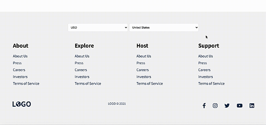

# React Travel Website

## About This Project

This website is a personal project built using React js. It serves as my playground for building components and interactive UI features. 

## Tech Stack

**Languages:** Javascript, JSX, CSS   
**Frameworks:** React.js  
**Environment:** Node.js    
**Image Editor:** Photoshop 

## Features & Screenshots

    

 
 

**Custom Carousel**

    

 
 

**REST API Integration**

    

 
 

**GraphQL API Integration**

    

 
 

**Mobile Responsive**

    

 

More to come...
 
 

## Inspiration

Airbnb, as well as Tripadvisor, are the inspirations for this site.
